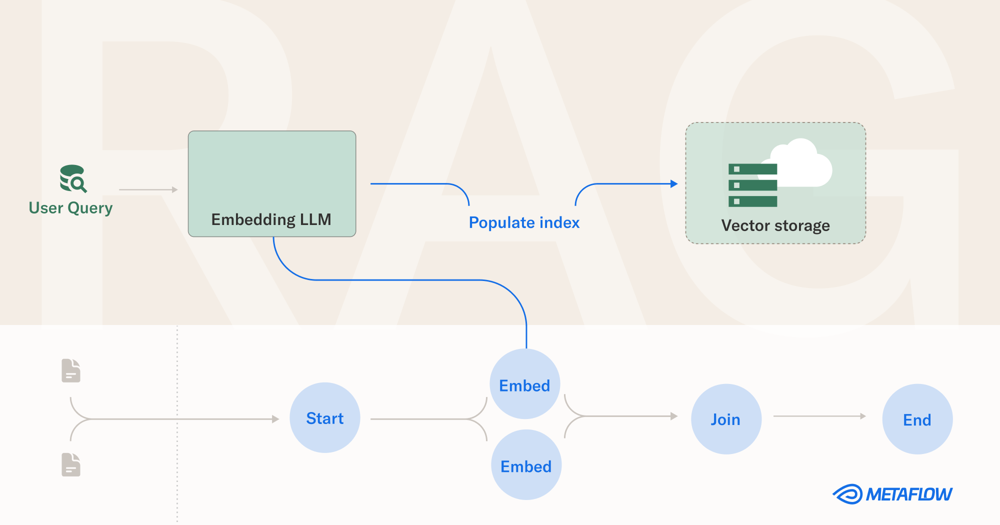

# Read this blog post for context: [Retrieval-Augmented Generation: How to Use Your Data to Guide LLMs](https://outerbounds.com/blog/retrieval-augmented-generation/) 

<a href="https://outerbounds.com/blog/retrieval-augmented-generation/">

</a>


# 📦  Setup

## With Conda, Mamba, or Micromamba
```
conda env create -f environment.yaml
```

## Without Conda
```
pip install -r requirements.txt
```

# 🔀🔁 Data collection workflows

## Chunk Markdown files in GitHub repositories

Run the repository extraction and Markdown chunking flow.
Looks in `/flows/config/repo_params.py` to specify new configurations; be mindful of repository licensing!
```
python flows/markdown_chunker.py run
```

## Post-process the results

Post-process the results of the `MarkdownChunker` flow. 
```
python flows/data_table_processor.py run
```

## Analyze what just happened
Let's inspect the results of these workflows in a notebook.

> If you are in a Conda environment, you need to install the kernel like so before opening the notebooks:
> ```
> pip install ipykernel
> python -m ipykernel install --user --name rag-demo --display-name "RAG demo"
> ```

Open `notebooks/analyze_chunks.ipynb` to use the Metaflow Client API to explore the results of the flow runs:
```
jupyter notebook notebooks/analyze_chunks.ipynb
```

# 🦙🧠 RAG time

## LlamaIndex
Now that we have indexed a bunch of source objects, let's index them and use them to modify an LLM context window.

You can either use a Llama 2 model, or OpenAI APIs. 
Letting LlamaIndex use Llama 2 runs locally, so it doesn't require an API key but takes a lot longer.
Using OpenAI APIs is faster and cheap. You can create/find your API key [here](https://platform.openai.com/account/api-keys).

Open `notebooks/llama_index_exploration.ipynb`
```
jupyter notebook notebooks/llama_index_exploration.ipynb
```

### ▶️ Run a demo in Streamlit

#### 🔑 Get an OpenAI API Key
Go [here](https://platform.openai.com/account/api-keys), copy your key value, and set the following environment variable:
```
export OPENAI_API_KEY=<YOUR KEY>
```

#### 🤖 Run the app
```
streamlit run chat_app.py
```

## Setup for indexing workflows
There are two indexing workflows in the `/flows` folder, one indexes into Pinecone for a VectorDB and another that uses the open-source LanceDB.
 
### 🔑 Get a Pinecone API Key
Go [here](https://app.pinecone.io/), create a Pinecone account if you have to, copy your API key, and set the following environment variable:
```
export PINECONE_API_KEY=<YOUR KEY>
```

Set the following environment variable too:
```
export GCP_ENVIRONMENT=us-central1-gcp
```

### ▶️ Run the flows
```
python flows/pinecone_index.py run
python flows/lancedb_index.py run
```